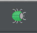

Tis the season to be celebrating Sir Isaac Newton's birthday and what better way to spend the days leading up to it than developing apps for Android, amirite?

I plan on writing some small but useful Android development tips every day until christmas. I attempt to wing this as I have absolutely no idea what I plan on writing.

# Tip #3

For this next tip, only really applies to the latest Lollipop release of Android. Previously, using the debug tool in Android studio would cause massive lag on the device and computer as the debugger attaches, but seems to be fixed in the latest version of Android/Android Studio which makes it incredibly easy to debug apps and check values of different variables.

You can either launch an app into debug mode using this icon

Or you can attach the debugger to an app using this icon and then selecting the process you wish to debug.

Another very useful piece of the debugger tool, is the "Evaluate" window which you can bring up either by pressing alt+f8 (mac) or going to run->Evaluate Expression which allows you to run snippets of code like changing an if statement to correct it, or seeing what a specific method would return.

# Tip #2

[Genymotion](http://genymotion.com) is a fantastic tool that is extremely useful for android development. It is *so* much faster than the Android emulator and does a pretty good job of emulating the OS with minimal bugs. Keep in mind that Genymotion is made for rapid development rather than finalisation, you should always use a real device for that as you can't anticipate the outcome of certain functionalities.

Anyone who you speak to who uses Genymotion will highly recommend it, I have yet to meet anyone who disagrees, and it is well worth the €99/yr as its constantly being updated with new features and VMs.

The main features of Genymotion include

#### Location spoofing

Using the location tool, you can set the device's current location

#### Data throttling

This is my favourite new feature of Genymotion because I work in a tier 1 internet building which means I get 300mb down, very bad for testing real-world scenarios on devices. This feature allows you to limit the data connection to the VM.

#### Screen capture

This is a cool feature to show off something from your app without needing to use screen capture on a rooted device, or having to download screen recording tools.

#### Drag and drop

You can drag and drop files into the vm and they get placed into the downloads folder on the SD card. Very useful if you need to get pictures or what not onto the device.

#### ID Changing

This feature allows you to change the device id of the device. Useful if you rely on the device id for identifying a device without user login.

### Downsides

The only real downside to Genymotion is that you have to wait until the AOSP is released before they can make a new VM for the latest OS (I.E Lollipop) and the VMs no longer come bundled with google apps due to licensing, but you can still install them by downloading the zip and installing them. [How to install google apps into Genymotion](http://stackoverflow.com/questions/17831990/how-do-you-install-google-frameworks-play-accounts-etc-on-a-genymotion-virt)

# Tip #1

Android studio is a great IDE. If you're still stuck on Eclipse, take the christmas period to migrate over. I did last year and have never looked back. I even went as far as to migrate a 2 year old project over to Android studio because it was literally quicker than working with Eclipse.

There's so much you can do that there will probably be a bunch of tips for it throughout the 24 days, so lets start off with an easy one.

Android studio has SCM build in to it (I only use git so I don't know if it supports others) and if you have your project roots set up in settings, you can make use of this feature.

You can use Android studio as a "diff" inspector if you click on the little gutter colour next to any changed lines. 

Clicking on it will show a small window which will allow you to do some commands such as; revert, see diff, and copy old text. It is incredibly useful, especially when you've changed or refactored a large amount of code.

