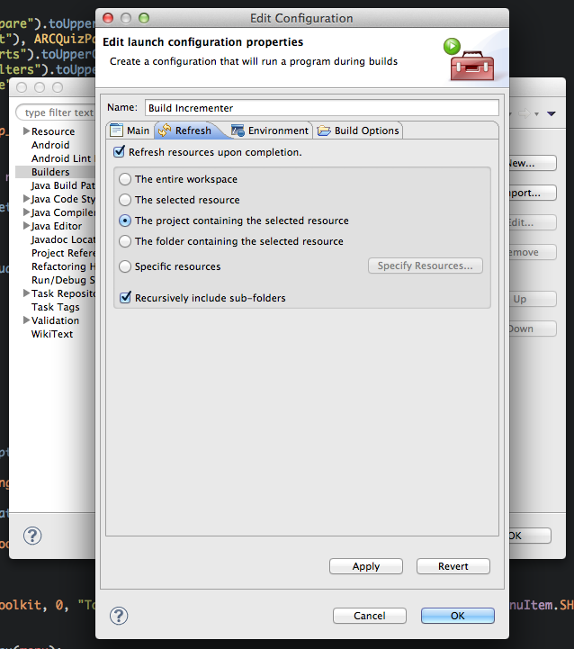

I've recently been wondering if there was a way in Eclipse to auto increment the versionCode automatically so I know what version the app my clients are using when they get a crash (to make sure that they actually did install the update they were supposed to) and after an hour of tinkering I figgured it out.

Firstly we need to create the script that will allow us to increment the version code

```ruby
#!/usr/bin/ruby

def increment(filename)
    # Read it
    file_str = ''
    if File.exists?(filename)
        file_str = File.open(filename, 'r') {|file| file.read }
    end 

    parts = file_str.match("android:versionCode=\"(.*)\"")
    text = parts[0]
    version = parts[1]
    newversion = (version.to_i + 1).to_s

    text = text.gsub(version, newversion)
    file_str = file_str.gsub(parts[0], text)

    # Write
    File.open(filename, 'w') {|file| file.write(file_str) }
    puts "incrementing from " + version + " to " + newversion
end

if ARGV.length < 1
    puts 'Usage: VersionIncrement '
else
    increment(ARGV.first)
end
```

Save this as "incrementer.rb" somewhere safe

Next, open up Eclipse, right click on your project and go properties.

Select "Builders" from the side


Click on "New"


Name the configuration anything you want.

For the location, click "Browse File System" and browse for the script

For the Working Directory click "Browse File System" and browse the root folder of your project (the one with AndroidManifest.xml in)

For Arguments, type "AndroidManifest.xml"

Next go to the Refresh tab



Select "The project containing the selected resource" This will refresh the manifest when it gets updated to avoid "file out of sync" errors

Next click OK and close the properties tab.

Now when ever you clean your project, or hit "run", the version code will increment by 1.