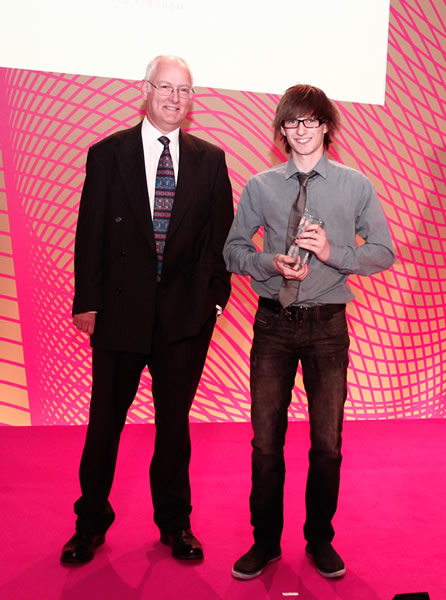
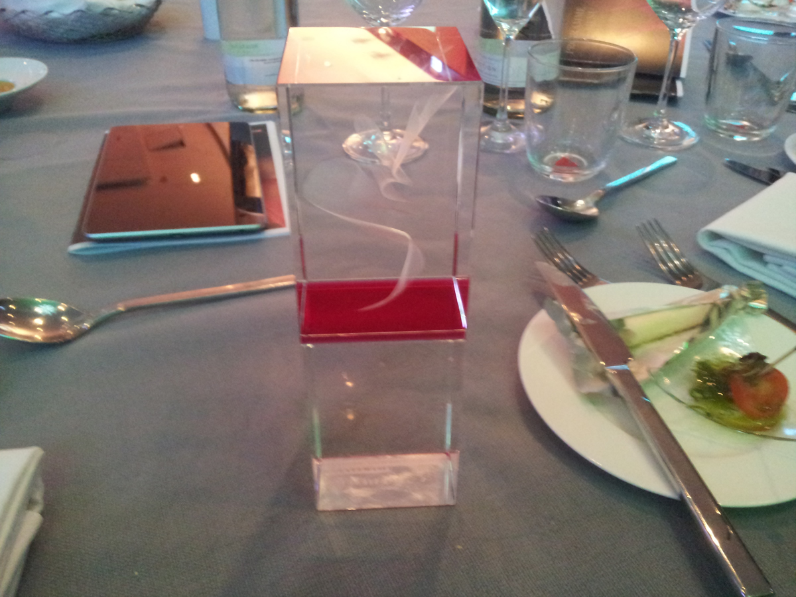

I recently attended the Digital Communications Award 2012 in Berlin for our app nomination [First aid by British](http://redcross.org.uk/app) and [American Red Cross](http://redcross.org/mobile-apps/first-aid-app) and guess what? WE WON!!

 

Our first ever award ever and I couldn't be happier. All the work we put into the app really paid off. Big shout outs to Marc Biles, Phillip Caudell, Matt Cheetham, Dan Gough, Janaka Lakmal, Dan Tarrent and of course, Duncan Cook.

Here is the acceptance speech I prepared but didn't get chance to read.

```
Good evening. On behalf of myself and all of the guys back at 3 sided cube who couldn't make it today, plus the great guys, Brad Smith, Matt Goldfedder and Grant Hansen and everyone from the British and American red cross would like to thanks you all for selecting the truly amazing, life saving app for this prestigious award. 

It really means a lot to all of us who put months of hard work, sweat, tears and i think even a little blood (thankfully there's an app for that!) Into creating this awesome piece of software. 
```

## Related Links
[3 SIDED CUBE](http://3sidedcube.com)
