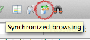

Now all you developers out there, prepare to have your MIND BLOWN.

Don't you find it annoying when you're using Filezilla to upload files to a server and you have to constantly match the folders up when you change directory on the server or local machine?

Ofcourse you do,

Simply press THIS BUTTON:

And when you click through to a folder on your server/local machine, Filezilla will try and match the other view.

THINK OF THE HOURS SAVED.

YOU'RE WELCOME.

## References

Thanks to [Steve](http://cruxoft.com) for finding it!